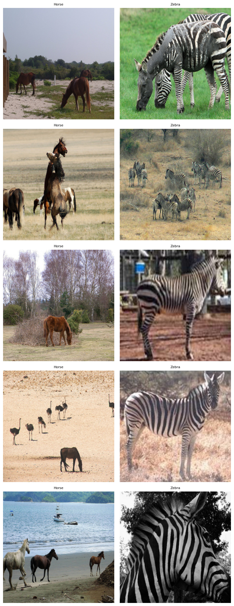
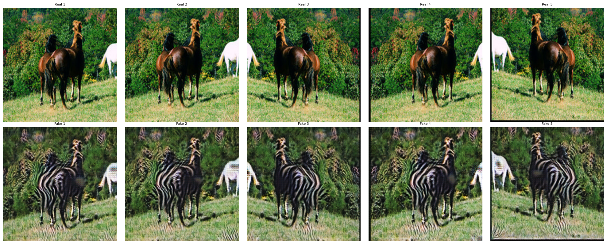
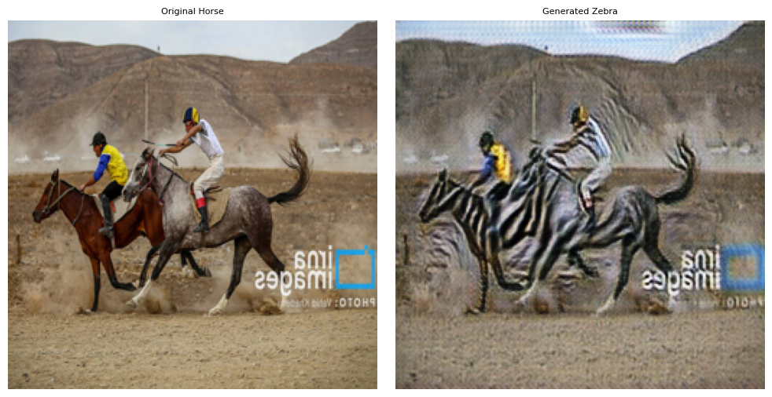
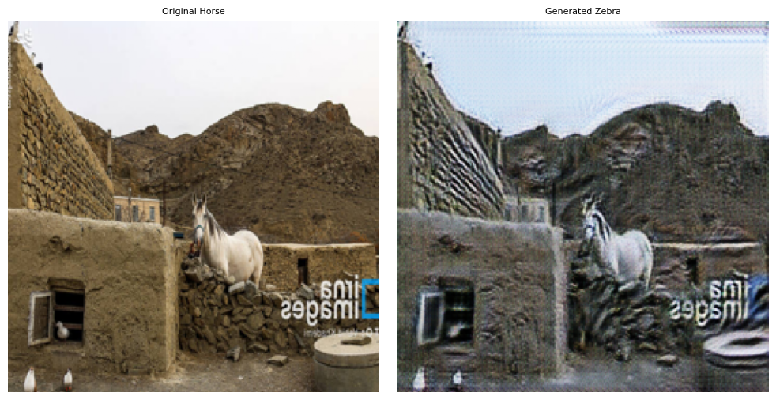
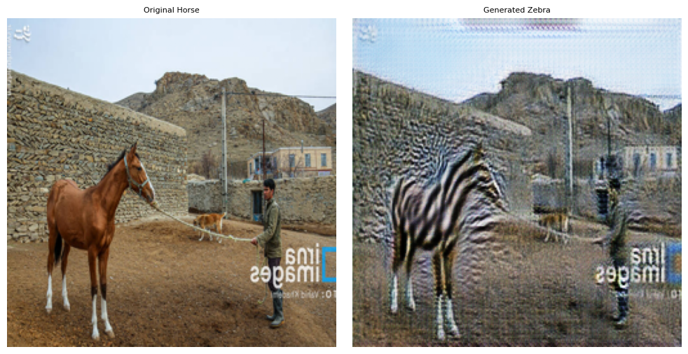
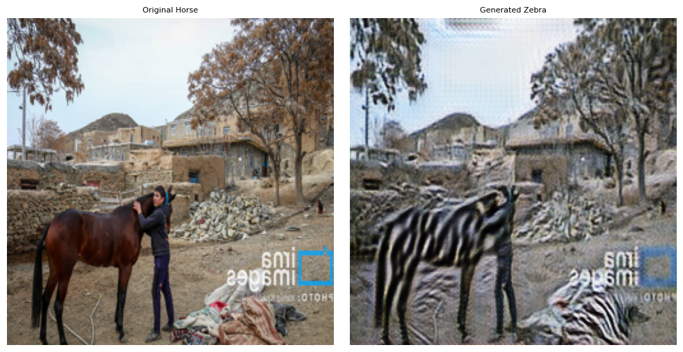
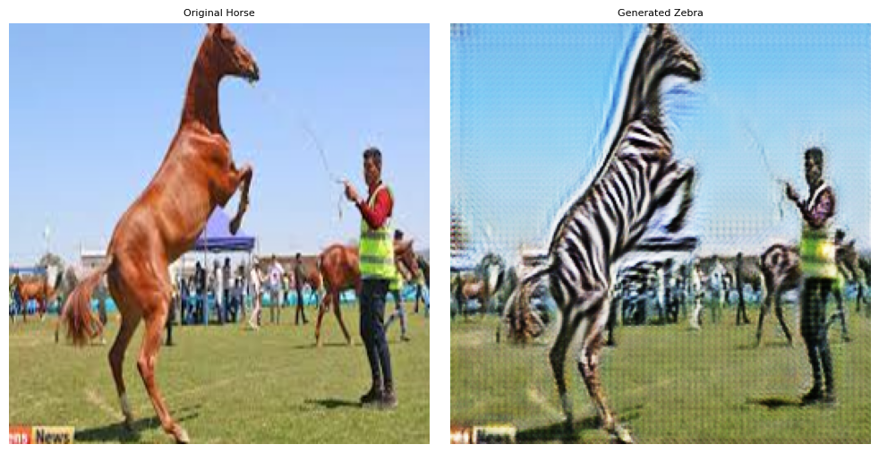
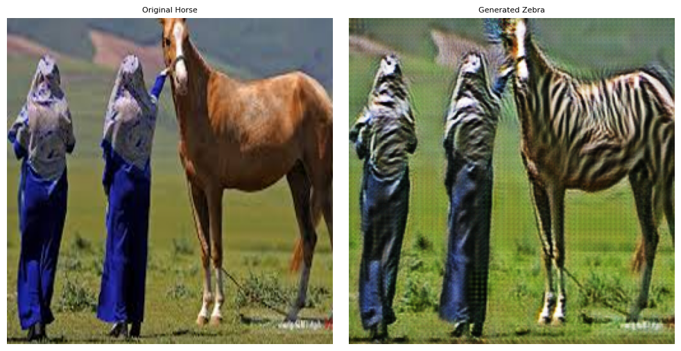

# Unpaired Image-to-Image Translation with CycleGAN (Horse $\leftrightarrow$ Zebra)

This repository provides an end-to-end PyTorch implementation of **Cycle-Consistent Generative Adversarial Networks (CycleGAN)** for unpaired image-to-image translation, trained to translate between horse and zebra domains without requiring aligned pair images.

---

## 📌 Project Highlights

- **From-Scratch Implementation**: Custom implementations of ResNet-based Generators (9 residual blocks, InstanceNorm, Reflection Padding) and 70x70 PatchGAN Discriminators.
- **Multi-Component Loss**: Full formulation of Least-Squares Adversarial Loss (LSGAN), Cycle Consistency Loss ($L_1$), and Identity Loss ($L_1$).
- **Stabilized Training**: History replay buffers for generated images to prevent discriminator oscillation and mode collapse.
- **Out-of-Distribution Generalization**: Zero-shot evaluation on unseen real-world photographs of Iranian Turkoman horses to assess texture transfer and domain adaptation.

---

## 🧠 Model Architecture & Methodology

CycleGAN learns mapping functions between two domains $X$ (Horses) and $Y$ (Zebras) using two generators ($G: X \to Y$, $F: Y \to X$) and two adversarial discriminators ($D_X, D_Y$).

### 1. Cycle Consistency Framework
The network enforces forward-backward cycle consistency ($x \to G(x) \to F(G(x)) \approx x$) and backward-forward cycle consistency ($y \to F(y) \to G(F(y)) \approx y$).


### 2. Generator and Discriminator Architecture
- **Generator ($G_{AB}, G_{BA}$)**: 
  - Downsampling with $7\times7$ and $3\times3$ convolutions + Instance Normalization + ReLU.
  - 9 Residual Blocks with Reflection Padding.
  - Upsampling with Transposed Convolutions + Tanh activation. (11.38M parameters each).
- **Discriminator ($D_A, D_B$)**:
  - $70\times70$ PatchGAN architecture with LeakyReLU ($\alpha = 0.2$) and Instance Normalization. (34.80M parameters each).


### 3. Optimization & Losses
The total generator loss combines three terms:

$$\mathcal{L}_{\text{total}} = \mathcal{L}_{\text{GAN}}(G, D_Y, X, Y) + \mathcal{L}_{\text{GAN}}(F, D_X, Y, X) + \lambda_{\text{cycle}} \mathcal{L}_{\text{cycle}}(G, F) + \lambda_{\text{identity}} \mathcal{L}_{\text{identity}}(G, F)$$

- **Adversarial Loss (Least Squares GAN)**: Stabilizes training dynamics compared to standard negative log-likelihood.
- **Cycle Consistency Loss ($\lambda_{\text{cycle}} = 10.0$)**: Penalizes $L_1$ reconstruction error between original and recovered images.
- **Identity Loss ($\lambda_{\text{identity}} = 5.0$)**: Encourages generators to preserve color tone and background features when fed images already belonging to the target domain.

---

## 📊 Dataset & Preprocessing

- **Dataset**: [Horse2Zebra Dataset on Kaggle](https://www.kaggle.com/datasets/balraj98/horse2zebra-dataset) (also available from [UC Berkeley CycleGAN Datasets](https://people.eecs.berkeley.edu/~taesung_park/CycleGAN/datasets/horse2zebra.zip)).
  - **Domain A (Horses)**: 1,067 training images, 120 test images.
  - **Domain B (Zebras)**: 1,334 training images, 140 test images.
- **Augmentation Pipeline**:
  - Resize to $286 \times 286$ using bicubic interpolation.
  - Random crop to $256 \times 256$.
  - Random horizontal flip ($p=0.5$).
  - Normalization to range $[-1, 1]$.

### Dataset Sample Preview


---

## 🔬 Experimental Results

### 1. Benchmark Test Set Evaluation (Horse $\rightarrow$ Zebra)
The model translates coat textures, stripes, and contours from horse to zebra while keeping the background context (grass, sky, fences) intact:



---

### 2. Generalization on Unseen Turkoman Horse Breeds
To evaluate the model's out-of-distribution robustness, real images of **Iranian Turkoman horses** (not present in the training set) were passed through the trained generator ($G_{AB}$):

| Sample 1 | Sample 2 |
| :---: | :---: |
|  |  |

| Sample 3 | Sample 4 |
| :---: | :---: |
|  |  |

| Sample 5 | Sample 6 |
| :---: | :---: |
|  |  |

---

## 📁 Repository Structure

```
GAN_Image_Translation_Generation/
├── GAN_Implementation.ipynb   # Main notebook with architecture, training loop, and evaluation
├── README.md                  # Detailed project documentation
└── results/                   # Extracted qualitative results and sample visualizations
    ├── dataset_samples.png
    ├── test_results_grid.png
    └── turkoman_horse_translation_1.png ... 8.png
```

---

## 🚀 Quickstart & Usage

### Prerequisites
Install PyTorch and required dependencies:
```bash
pip install torch torchvision pillow matplotlib
```

### Running the Notebook
Open `GAN_Implementation.ipynb` in Jupyter Notebook, JupyterLab, or Google Colab:
```bash
jupyter notebook GAN_Implementation.ipynb
```
Follow the cells to inspect the architecture, train from scratch, or load saved checkpoints (`.pth`) for inference.
